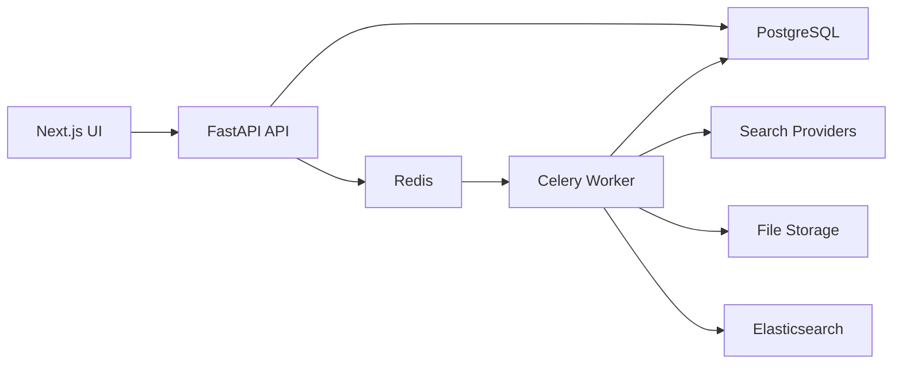

# PPT Hunter

AI-powered discovery platform for publicly accessible PowerPoint decks.

## What is included

- FastAPI backend with search runs, document inventory, downloads, extraction, and enrichment APIs.
- Celery worker for discovery, download, extraction, and categorization jobs.
- PostgreSQL for durable records.
- Redis for Celery broker/result backend.
- Elasticsearch for searchable extracted content.
- Next.js frontend for search operations and document review.
- Supabase-first setup for PostgreSQL, plus private file storage on local disk, Supabase Storage, or AWS S3.
- Internet Archive provider for public `.ppt` / `.pptx` discovery without an API key.
- All-source discovery mode plus bulk download queueing for up to 500 discovered decks per action.
- One-click `Queue all + ZIP` export for up to 500 downloaded presentation files.

## Quick Start

1. Choose storage: local disk for development, Supabase Storage, or a private AWS S3 bucket.
2. Copy `.env.example` to `.env`.
3. Fill in `DATABASE_URL`, `REDIS_URL`, `ELASTICSEARCH_URL`, and the variables for your chosen storage backend.
4. Make sure Python 3.11+, Node.js 20+, and Redis are available. Elasticsearch/OpenSearch can be added after ingestion is working.
5. Install backend dependencies:

```powershell
.\scripts\setup_backend.ps1
```

6. Start the API, worker, and frontend in three terminals:

```powershell
.\scripts\run_backend.ps1
.\scripts\run_worker.ps1
.\scripts\run_frontend.ps1
```

Open the frontend at `http://localhost:3000`. Backend API docs are at `http://localhost:8000/docs`.

Without search provider keys, PPT Hunter uses Internet Archive through its public search and metadata APIs. Select the `Mock` provider in the UI to exercise the workflow without external network calls.

Use `setup_guide_supabase.md` for the complete no-Docker Supabase setup, or `setup_guide.md` for the AWS S3 storage setup.

## Provider Strategy

Recommended production order:

1. Brave Search API for compliant first-party web search.
2. Internet Archive for public archived deck files and no-key discovery.
3. DataForSEO or Bright Data for multi-engine SERP coverage.
4. Raw search-engine scraping only after legal review and only behind provider abstractions.

Use the `All configured sources` provider in the UI to query every enabled provider in one run. It includes Internet Archive by default, Brave when `BRAVE_SEARCH_API_KEY` is present, and Google/Bing/DuckDuckGo when DataForSEO credentials are present.

Use `Find 500 + download all` to discover up to 500 public decks and queue every new result for download in one click. Use `Queue all + ZIP` in the document queue to bulk-download every currently discovered or failed deck, wait for active downloads, and then download a ZIP of the files that landed in storage.

Searches support up to 500 requested results. When auto-download or `Queue all + ZIP` is enabled, PPT Hunter queues all eligible documents immediately; actual parallelism is controlled by the Celery worker count so the platform can scale without opening hundreds of direct download connections from one process.

## Architecture


